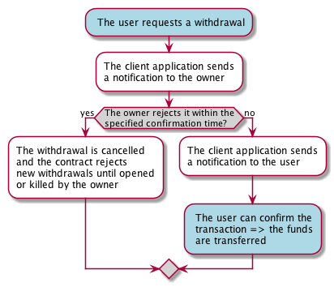

# Safe Wallet

## About
Safe wallet is a smart contract running on the Ethereum blockchain. It is
a wallet for ETH and ERC20 tokens, allowing cancellation of withdrawals from the 
contract. 

### Owner
The contract creator becomes the owner of the wallet, having rights to 
cancel withdrawals, modify preferences, add users, and kill the contract.

### Users 
Users are addresses added to the contract by the owner. They have right to 
request withdrawals from the contract. When the specified waiting period 
after a withdrawal request has passed, if the owner has not cancelled the 
withdrawal, the user can complete the withdrawal.

### Events
An event is fired on each deposit to the contract, withdrawal request from
the contract, and cancellation of a withdrawal. By listening the withdrawal
events (by means of a client application), the user can react to possible
unintended withdrawals by canceling them and locking the wallet.


### Why?
The idea is that one do not have to worry about keeping the private key file of
the user account in devices that are connected to the Internet, as long as the
owner address is stored securely. The owner address/account is however needed
in the following cases: when the contract is deployed, when the contract settings
are modified, when a request must be cancelled, or when the contract is killed
(in which case the remaining funds are transferred to the owner. These special
transactions can be generated offline to ensure security.



## Methods

TODO

## Deployment

TODO

## Testing

This project uses [Truffle framework](http://truffleframework.com/) which 
provides Mocha + Chai libraries for testing solidity contracts through 
[web3.js](https://github.com/ethereum/web3.js/) interface.

Install Truffle:
```
npm install -g truffle
``` 

Run unit tests:
```
truffle test
``` 

## Future features:
 - ability to limit withdrawals to trusted addresses that are managed by the owner
 - support for multiple users (shared wallet)